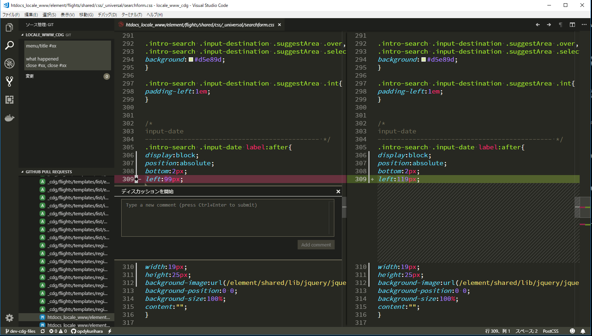

# hubコマンドについて
https://hub.github.com/  
GitHub に対する操作をコマンドラインから行うためのツール。

## hubコマンドをインストールする
### macの場合
brewで簡単にインストールできる。
```
$ brew install hub
$ alias git=hub
$ git version
git version 2.17.0
hub version 2.3.0 # ← it works!
```

### windowsの場合
https://github.com/github/hub/releases
上記のURLからinstall.batをダウンロードする。
hub xxxで利用もできるが、gitコマンドを拡張したかのように使う方法が推奨されているらしいので、
bash_profileなどにaliasを貼って使う。

.bash_profile
```
eval "$(hub alias -s)"
```

```
$ git version
git version 2.17.0
hub version 2.3.0 # ← it works!
```

## hubコマンドで出来ること
* [browse](https://hub.github.com/hub-browse.1.html)  
ブラウザでgithubページを開く
* [issue](https://hub.github.com/hub-issue.1.html)  
issueを作成・確認する
* [pr](https://hub.github.com/hub-pr.1.html)  
プルリクエストを確認する
* [pull-request](https://hub.github.com/hub-pull-request.1.html)  
プルリクエストを作成する
* [release](https://hub.github.com/hub-release.1.html)  
リリースを作成する
* [compare](https://hub.github.com/hub-compare.1.html)  
ブラウザでgithubページを開いて比較を確認する
* [sync](https://hub.github.com/hub-sync.1.html)  
ブランチを更新する
* [ci-status](https://hub.github.com/hub-ci-status.1.html)  
コミットのGitHubチェックのステータスを表示する
* [create](https://hub.github.com/hub-create.1.html)  
リポジトリを作成する
* [delete](https://hub.github.com/hub-delete.1.html)  
リポジトリを削除する
* [fork](https://hub.github.com/hub-fork.1.html)  
リポジトリをフォークする


## githubページをデフォルトブラウザを立ち上げて確認する
```
$ git browse
```
* issueをデフォルトブラウザで確認する
```
$ git browse -- issues
$ git browse -- issues/22
```
* プルリクをデフォルトブラウザで確認する
```
$ git browse -- pulls
$ git browse -- pull/22
```

## ターミナルでissueを確認する
`Usage: hub issue [-a ASSIGNEE] [-c CREATOR] [-@ USER] [-s STATE] [-f FORMAT] [-M MILESTONE] [-l LABELS] [-d DATE] [-o SORT_KEY [-]] [-L LIMIT]`
```
$ git issue
```
* closeされたissueを確認する例
```
$ git issue -s closed
```

### issueを作成する
`Usage: hub issue create [-oc] [-m MESSAGE|-F FILE] [--edit] [-a USERS] [-M MILESTONE] [-l LABELS]`
* MILESTONEは文字列ではなくIDで指定する。
* プロジェクトを指定するオプションはない。(ver2.5.1時点)
```
$ git issue create
```
* アサイン/マイルストーン/ラベルをセットし、  
issueテンプレートを利用してissueを作成する例
```
$ git issue create -a opdykurihara -M 3 -l enhancement -F .github/ISSUE_TEMPLATE.md --edit
```
* .gitconfigのalias例
```
iss = !hub issue create -a opdykurihara -l enhancement -F .github/ISSUE_TEMPLATE --edit
```

#### Tips：コミットメッセージにissueタイトルを入れる
issue確認コマンドと組み合わせて、コミットメッセージにissueタイトルを入れてみる

#45のissueタイトルを入れる例
```
$ git issue -f '%t #%I%n' | grep '#45' | git commit -F - --edit;
```
* .gitconfigのalias例
```
cmi = "!f(){ hub issue -f '%t #%I%n' | grep '#'$1 | git commit -F - --edit;};f"
```
下記のようにaliasを利用できる
```
$ git cmi 45
```

## pull requestを作る
https://hub.github.com/hub-pull-request.1.html  
`Usage: hub pull-request [-focp] [-b <BASE>] [-h <HEAD>] [-r <REVIEWERS> ] [-a <ASSIGNEES>] [-M <MILESTONE>] [-l <LABELS>]`

```
$ git pull-request
```
アサイン/レビュアーを入れてプルリクを作る例
```
$ git pull-request -a opdykurihara -r user1 -r user2 -b master -h $(git symbolic-ref --short HEAD) -m '[menu]title' --edit
```
* .gitconfigのalias例
```
prp = !hub pull-request -a opdykurihara -r user1 -r user2 -b master -h $(git symbolic-ref --short HEAD) -m '[menu]title' --edit
```
下記のようにaliasを利用できる
```
$ git prp
```

### Tips：issue番号に紐くpull requestを作る
issue確認コマンドと組み合わせて、プルリクのタイトルにissueタイトルを入れてみる  
※hub issue -iオプションでissue番号に紐づくプルリクが作成できるが、  
将来なくなる予定の機能らしいのでここでは利用しない。

45のissueタイトルを入れてプルリクエストを作る例
```
$ git issue -f '%t #%I%n' | grep '#45' | hub pull-request -F - -b master -h $(git symbolic-ref --short HEAD) --edit;
```
* .gitconfigのalias例
```
pri = "!f(){ hub issue -f '%t #%I%n' | grep '#'$1 | hub pull-request -F - -a opdykurihara -b master -h $(git symbolic-ref --short HEAD) --edit;};f"
```
下記のようにaliasを利用できる
```
$ git pri 45
```

## リリースタグを作る
`Usage: hub release create [-dpoc] [-a FILE] [-m MESSAGE|-F FILE] [-t TARGET] TAG`
```
$ git tag [TAGNAME]
$ git push origin [TAGNAME]
$ git release create -m 'Release-YYYYMMDD' -t master [TAGNAME] --edit
```

---
## 番外編：プルリクはvscodeで確認・承認が便利。
[GitHub Pull Requests](https://marketplace.visualstudio.com/items?itemName=GitHub.vscode-pull-request-github)
をvscodeにインストールする。

vscode上で差分確認し、ディスカッションしたり、
承認やコメントなども記述できる。




## vscodeでコミット/リベースメッセージが文字化けする場合
vscodeの設定でgit-commit、git-rebaseファイルのautoGuessEncodingをfalseとし、エンコードをutf8にしておく。
```
    "[git-commit]": {
        "files.autoGuessEncoding": false,
        "files.encoding": "utf8"
    },
    "[git-rebase]": {
        "files.autoGuessEncoding": false,
        "files.encoding": "utf8"
    },
```

## テンプレートのコメントアウト文字列を変更する
マークダウンでテンプレートを記述する場合[#]をタイトルとして利用したいので、
別の文字列に変更しておくと便利。  
* コメントを[;]とする例
```
$ git config --global core.commentchar ';'
```


