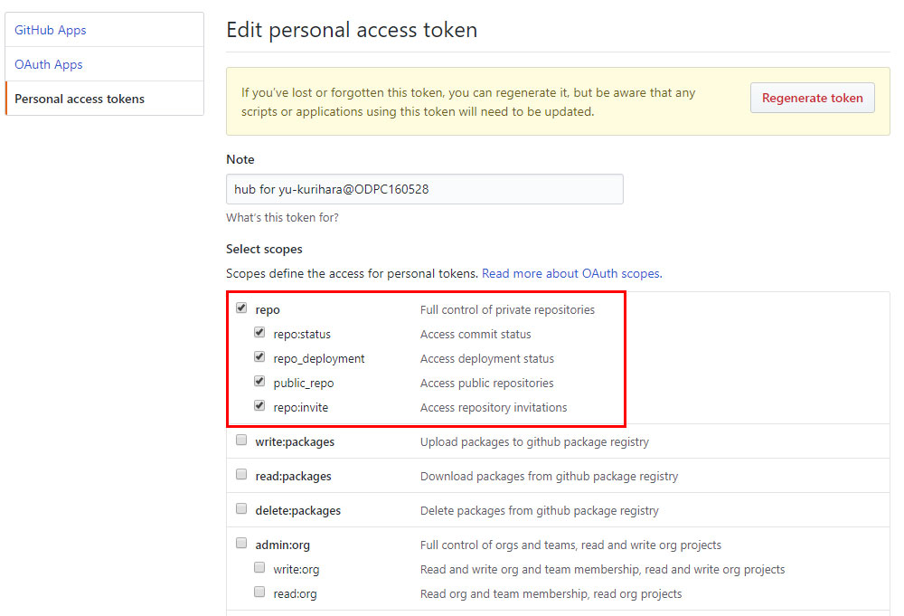

# github subアカウントでhubコマンドを利用する

## auth_tokenを作成する
auth_tokenはgithubの[Personal access tokens]で作成する。
[select scopes]の[repo]に全部チェックを付ける



## アカウントが複数ある場合、hubのconfigファイル(hub)をそれぞれ作成する
~/.config/mainaccount_name/hub
```
github.com:
- user: mainaccount_name
  oauth_token: xxxxxxxxx
  protocol: https
```
~/.config/subaccount_name/hub
```
github.com:
- user: subaccount_name
  oauth_token: xxxxxxxxx
  protocol: https
```

## ローカルリポジトリのgit config設定でhubのuserをsubaccount_nameにする
`hub config --local hub.user subaccount_name`

## 実行方法
ex)
`HUB_CONFIG=~/.config/subaccount_name/hub git issue`

毎回打ち込むのが面倒なので、.bashrcに以下の記述を追加する
```
export GIT_USER=`git config --get user.name`
export HUB_CONFIG=~/.config/$GIT_USER/hub
```

## 別の方法
* GITHUB_TOKENを指定する
ex)
`GITHUB_TOKEN=xxxxxxxxx git issue`

* direnvを使用する(ちょっと難しそう・・・)
[direnvを使用する方法](https://github.com/github/hub/issues/1300)

